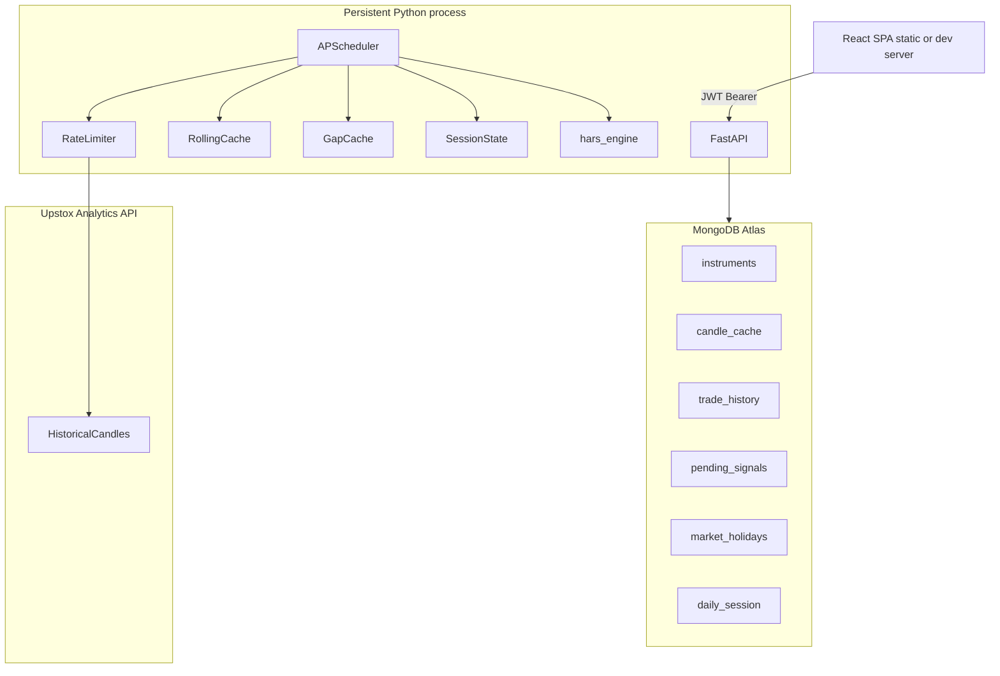
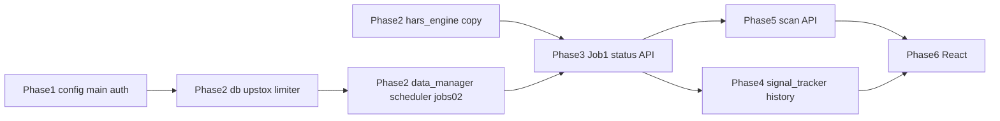

# HARS Signal Dashboard — Implementation Plan

## Source of truth and non-negotiables

- All numeric behavior comes from a **verbatim copy** of `hars_strategy_engine.py` into [`backend/hars_engine.py`](hars-dashboard/backend/hars_engine.py) (Section 6, Phase 2.1). **Do not** reimplement Hurst, regime, or `get_signals`; only adapt imports/wiring if needed.
- **MongoDB Atlas only** for persistence ([Section 5](d:\Desktop\Hars\HARS_RULEBOOK.md), [Section 12](d:\Desktop\Hars\HARS_RULEBOOK.md)): `instruments`, `candle_cache`, `trade_history`, `pending_signals`, `market_holidays`, `daily_session` ([Section 12](d:\Desktop\Hars\HARS_RULEBOOK.md) lists `daily_session`; Section 2 folder diagram omits it—model it in [`backend/db.py`](hars-dashboard/backend/db.py)).
- **Every APScheduler cron trigger** uses `timezone='Asia/Kolkata'` ([Section 5](d:\Desktop\Hars\HARS_RULEBOOK.md), [Section 13](d:\Desktop\Hars\HARS_RULEBOOK.md)).
- **Backend independence**: one long-running Python process runs FastAPI + scheduler + Upstox fetchers + engine; the browser never drives jobs ([Section 5](d:\Desktop\Hars\HARS_RULEBOOK.md)). For production, the rulebook’s [`render.yaml`](hars-dashboard/render.yaml) serves the SPA from the same web service for convenience; the **logical** boundary is: frontend only calls HTTP APIs and holds JWT—no shared state. Local/dev can run `uvicorn` without building the frontend and jobs still run.

**Prerequisite artifact:** Obtain `hars_strategy_engine.py` from your backtest repo before Phase 2.1; it is not in the workspace today.

---

## Architecture (high level)

---

## File-by-file build order (mapped to Section 16 phases)

Paths follow [Section 2](d:\Desktop\Hars\HARS_RULEBOOK.md) with additions where the rulebook implies extra modules for clarity.

### Phase 1 — Skeleton

| Order | File | Purpose |
|------:|------|--------|
| 1.1 | [`requirements.txt`](hars-dashboard/requirements.txt) | fastapi, uvicorn, httpx, motor, pymongo, python-jose/cryptography, passlib or constant-time compare, APScheduler, pytz, pandas, numpy, python-multipart |
| 1.1 | [`backend/config.py`](hars-dashboard/backend/config.py) | Load [Section 3](d:\Desktop\Hars\HARS_RULEBOOK.md) env vars; fail fast if missing critical vars |
| 1.1 | [`backend/main.py`](hars-dashboard/backend/main.py) | FastAPI app, **lifespan**: connect DB with exponential backoff ([Section 14](d:\Desktop\Hars\HARS_RULEBOOK.md)), init scheduler only after DB ready, shutdown cleanup |
| 1.2 | [`backend/main.py`](hars-dashboard/backend/main.py) (same) | `GET /api/health` → `{"status":"ok","cache_ready": bool}` ([Section 9](d:\Desktop\Hars\HARS_RULEBOOK.md)) — `cache_ready` wired in Phase 2+ |
| 1.3 | [`backend/auth.py`](hars-dashboard/backend/auth.py) | JWT create/verify, 12h expiry ([Section 4](d:\Desktop\Hars\HARS_RULEBOOK.md)) |
| 1.3 | [`backend/main.py`](hars-dashboard/backend/main.py) | `POST /api/login`, dependency for Bearer JWT on all `/api/*` except login and health (confirm whether health stays public for Job 6—rulebook says internal GET `/api/health`; use no auth or same-machine-only is not available on Render—**use unauthenticated `/api/health`** for keep-alive unless you add a separate internal route) |
| 1.4 | [`render.yaml`](hars-dashboard/render.yaml), [`.env.example`](hars-dashboard/.env.example) | [Section 12](d:\Desktop\Hars\HARS_RULEBOOK.md) |

**Dependency:** `config` → `db` (minimal stub) → `auth` → `main`. No scheduler until Phase 2.

**Phase 1 gotchas**

- **Health + keep-alive:** Job 6 calls `GET /api/health` ([Section 5](d:\Desktop\Hars\HARS_RULEBOOK.md)); keep it unauthenticated or keep-alive breaks.
- **Static mount last:** Register all `/api/*` routes **before** `StaticFiles` mount ([Section 12](d:\Desktop\Hars\HARS_RULEBOOK.md)).

---

### Phase 2 — Data layer

| Order | File | Purpose |
|------:|------|--------|
| 2.1 | [`backend/hars_engine.py`](hars-dashboard/backend/hars_engine.py) | Verbatim copy of `hars_strategy_engine.py` ([Section 6](d:\Desktop\Hars\HARS_RULEBOOK.md)) |
| 2.2 | New: `backend/upstox_client.py` (or inside `data_manager.py` if small) | `httpx.AsyncClient`, `GET /v2/historical-candle/...` ([Section 5.3](d:\Desktop\Hars\HARS_RULEBOOK.md)), parse `[timestamp, open, high, low, close, volume, oi]` |
| 2.2 | New: `backend/rate_limiter.py` | **Global async guard** before every Upstox call: counts per **1s / 1min / 30min** vs limits 10 / 500 / 2000 ([Section 0](d:\Desktop\Hars\HARS_RULEBOOK.md)); when near ceiling, `await` sleep; target steady **≤5 req/s** via `asyncio.sleep(0.2)` **between** calls ([Section 5](d:\Desktop\Hars\HARS_RULEBOOK.md)) |
| 2.2–2.4 | [`backend/db.py`](hars-dashboard/backend/db.py) | Motor client, indexes: `candle_cache` unique `(instrument_key, timestamp)` ([Section 5.2](d:\Desktop\Hars\HARS_RULEBOOK.md)); helpers for instruments, holidays, candle_cache CRUD, `daily_session` |
| 2.2–2.4 | [`backend/data_manager.py`](hars-dashboard/backend/data_manager.py) | `rolling_cache` dict keyed by symbol or `instrument_key` ([Section 5.2](d:\Desktop\Hars\HARS_RULEBOOK.md)): Index/VIX **500**×5m DataFrames; stocks **25**×5m; `gap_cache` dict; `current_state` for API; **cache state machine** (see below) |
| 2.2–2.4 | [`backend/scheduler.py`](hars-dashboard/backend/scheduler.py) | `BackgroundScheduler` with `timezone='Asia/Kolkata'`; Job 0, 0b, 1, 3, 4, 5, 6 ([Section 5](d:\Desktop\Hars\HARS_RULEBOOK.md)) |

**Cache / session readiness state machine** (`data_manager` + `daily_session` as needed):

- **WARMING_UP** — Set during Job 0 while Index/VIX and stock bars are still loading.
- **WARMING_UP_GAP** — Transition once **all** required bars are loaded (Index/VIX at 500 each, stocks at 25 each) but Job 0b has **not** finished; system is waiting for the 09:18 gap fetch.
- **READY** — Transition **only after** Job 0b completes and `gap_cache` is populated for the day (gap fetch at 09:18).
- **INSUFFICIENT** — **Terminal for the day:** set when Index or VIX has **fewer than 100** bars after Job 0’s load path (Hurst minimum not met). Log CRITICAL; **do not** run regime classification for the day — regime stays **UNKNOWN** (per rulebook). This state does not advance to READY via normal gap flow until the next trading day’s Job 0.

Transition order: `WARMING_UP` → `WARMING_UP_GAP` → `READY`. `INSUFFICIENT` is set from Job 0 outcome when applicable and overrides progression to a “ready for trading” day.

**Startup / restart behavior** ([Section 5](d:\Desktop\Hars\HARS_RULEBOOK.md), [Section 14](d:\Desktop\Hars\HARS_RULEBOOK.md)): load active `instruments`; if empty, seed `BOOTSTRAP_NIFTY50` then refresh; load Index/VIX from `candle_cache` into memory; re-fetch 25 bars per stock; restore `daily_session` for today’s `h_idx`, `h_vix`, `regime`; if gap missing after 09:18 scenario, run gap job logic.

**Phase 2 gotchas**

- **Which candle Job 1 fetches (5m boundaries):** A named candle’s **close time** is the next 5-minute boundary in IST. Example: the **09:20** candle **closes at 09:25:00 IST** (not 09:24:59). Job 1 runs at **:15** seconds past each minute; at **09:25:15** it must fetch the candle whose close was the **most recent** completed 5-minute boundary — i.e. the **09:20** bar — **not** the 09:25 bar, which has not closed yet. General rule: after T+15s from a boundary, fetch the **latest fully closed** 5m candle for each instrument.
- **15s candle buffer:** Job 1 at **:15** past each 5m boundary ([Section 5](d:\Desktop\Hars\HARS_RULEBOOK.md)); do not fetch a candle until ≥15s after its **scheduled close** (e.g. 09:25:00 + 15s); align cron with IST.
- **Rate limits:** Stagger alone is insufficient—implement **token bucket / sliding windows** for 1s, 1min, 30min ([Section 0](d:\Desktop\Hars\HARS_RULEBOOK.md)). On **429**: log CRITICAL, halt Upstox 60s ([Section 14](d:\Desktop\Hars\HARS_RULEBOOK.md)). On **401**: halt and surface “Data Feed Error” ([Section 14](d:\Desktop\Hars\HARS_RULEBOOK.md)).
- **Phase 7 checklist wording:** Rulebook says “max 5 concurrent requests” ([Section 16](d:\Desktop\Hars\HARS_RULEBOOK.md) 7.2) but operational design is **~5 requests/sec sequential** with sleep ([Section 5](d:\Desktop\Hars\HARS_RULEBOOK.md)). Implement **sequential stagger + global counters**, not 52 parallel coroutines without a gate.
- **`to_date`:** Never future; use “today” in IST ([Section 5.3](d:\Desktop\Hars\HARS_RULEBOOK.md)).
- **Missing bars / gaps:** When backfilling to 500, skip weekends and `market_holidays` ([Section 5.2](d:\Desktop\Hars\HARS_RULEBOOK.md)).
- **Job 0b:** 50×2 calls, **sleep 0.2s between every call** (not between pairs) ([Section 5](d:\Desktop\Hars\HARS_RULEBOOK.md)); `prev_trading_day` must skip weekends and holidays.
- **Job 5:** “1st trading day of quarter” is **not** simply `day==1`—compute next run from calendar + holiday table.

**Verification gates (Section 16.2.5–2.7):** Log counts after Job 0 and 0b; unit/integration tests with mocked Upstox responses where possible.

---

### Phase 3 — Engine integration

| Order | File | Purpose |
|------:|------|--------|
| 3.1 | [`backend/scheduler.py`](hars-dashboard/backend/scheduler.py) | Job 0: after data load, `returns = close.pct_change().dropna()`, `calculate_hurst` on returns ([Section 6.1](d:\Desktop\Hars\HARS_RULEBOOK.md)); if `<100` bars → `INSUFFICIENT`, regime UNKNOWN ([Section 5.2](d:\Desktop\Hars\HARS_RULEBOOK.md)); else `classify_regime` once, persist `daily_session` |
| 3.1 | [`backend/scheduler.py`](hars-dashboard/backend/scheduler.py) | Job 1: fetch 1 candle per instrument, append/trim, **do not** recompute Hurst/regime; read session; `get_signals(regime, stock_data_pool)` ([Section 5](d:\Desktop\Hars\HARS_RULEBOOK.md)) |
| 3.2 | [`backend/main.py`](hars-dashboard/backend/main.py) | `GET /api/status` shape ([Section 9](d:\Desktop\Hars\HARS_RULEBOOK.md)); pending UI: `—` / `cache_ready` ([Section 11](d:\Desktop\Hars\HARS_RULEBOOK.md)) |

**Phase 3 gotchas**

- **Hurst once per day:** Job 1 must **not** call `classify_regime` again ([Section 5](d:\Desktop\Hars\HARS_RULEBOOK.md)).
- **Empty candle row:** Skip instrument; do not run partial engine incorrectly ([Section 14](d:\Desktop\Hars\HARS_RULEBOOK.md)).
- **Engine outside 09:15–15:30:** Do not run; dashboard shows last state ([Section 6.4](d:\Desktop\Hars\HARS_RULEBOOK.md)).

---

### Phase 4 — Trade tracking

| Order | File | Purpose |
|------:|------|--------|
| 4.1 | [`backend/db.py`](hars-dashboard/backend/db.py) | Schemas for `trade_history`, `pending_signals` ([Section 8](d:\Desktop\Hars\HARS_RULEBOOK.md)) |
| 4.2 | [`backend/signal_tracker.py`](hars-dashboard/backend/signal_tracker.py) | Create PendingSignal in memory + Mongo when signal exists, regime ≠ NO_TRADE; **max one** pending per day ([Section 5](d:\Desktop\Hars\HARS_RULEBOOK.md)); entry = signal candle **close** |
| 4.3 | [`backend/scheduler.py`](hars-dashboard/backend/scheduler.py) | Job 4 at **:45**, `is_market_open()` 09:15–15:10 ([Section 5](d:\Desktop\Hars\HARS_RULEBOOK.md)); TP/SL from **cache only**—no extra Upstox call |
| 4.4 | [`backend/scheduler.py`](hars-dashboard/backend/scheduler.py) | Job 3 at 15:15: EOD exit from **15:10** candle close ([Section 5](d:\Desktop\Hars\HARS_RULEBOOK.md)); NO_TRADE day record if no pending and regime NO_TRADE/UNKNOWN all day ([Section 8](d:\Desktop\Hars\HARS_RULEBOOK.md)) |
| 4.5 | [`backend/main.py`](hars-dashboard/backend/main.py) | `GET /api/history` newest first ([Section 9](d:\Desktop\Hars\HARS_RULEBOOK.md)) |

**Phase 4 gotchas**

- **Ordering vs Job 1:** Job 4 runs **after** Job 1’s fetch for that cycle (:45 after :15) ([Section 5](d:\Desktop\Hars\HARS_RULEBOOK.md)).
- **WIN/LOSS/BREAKEVEN** rules ([Section 8](d:\Desktop\Hars\HARS_RULEBOOK.md)).
- **Restart:** reload `pending_signals` from Mongo ([Section 14](d:\Desktop\Hars\HARS_RULEBOOK.md)).

---

### Phase 5 — Scan table

| Order | File | Purpose |
|------:|------|--------|
| 5.1–5.2 | New: `backend/scan_service.py` or methods in `data_manager.py` | Per stock: RVOL, ATR%, Gap% from `gap_cache`, Momentum 15m ([Section 10](d:\Desktop\Hars\HARS_RULEBOOK.md)); compliance score + tie-break ([Section 10](d:\Desktop\Hars\HARS_RULEBOOK.md)) |
| 5.3 | [`backend/main.py`](hars-dashboard/backend/main.py) | `GET /api/scan` sorted descending by compliance ([Section 9](d:\Desktop\Hars\HARS_RULEBOOK.md)) |

**Phase 5 gotchas**

- **ATR% for table:** `(high.max()-low.min())/latest_close*100` ([Section 10](d:\Desktop\Hars\HARS_RULEBOOK.md))—ensure same window as engine intraday pool.
- **Gap% pending:** Until Job 0b, show `—` not 0 ([Section 0](d:\Desktop\Hars\HARS_RULEBOOK.md), [Section 10](d:\Desktop\Hars\HARS_RULEBOOK.md)).
- **SIGNAL row** must match `get_signals` pick ([Section 16](d:\Desktop\Hars\HARS_RULEBOOK.md) 5.4).

---

### Phase 6 — Frontend

| Order | File | Purpose |
|------:|------|--------|
| 6.x | [`frontend/vite.config.js`](hars-dashboard/frontend/vite.config.js), `package.json`, `index.html` | Vite + React |
| 6.1 | [`frontend/src/pages/Login.jsx`](hars-dashboard/frontend/src/pages/Login.jsx) | Pixel spec [Section 4](d:\Desktop\Hars\HARS_RULEBOOK.md), [Section 11](d:\Desktop\Hars\HARS_RULEBOOK.md) |
| 6.2 | [`frontend/src/components/Navbar.jsx`](hars-dashboard/frontend/src/components/Navbar.jsx) | IST clock `setInterval` 1s ([Section 11](d:\Desktop\Hars\HARS_RULEBOOK.md)) |
| 6.3 | [`frontend/src/components/HeroStrip.jsx`](hars-dashboard/frontend/src/components/HeroStrip.jsx) | Poll `/api/status`; `—` when not ready ([Section 11](d:\Desktop\Hars\HARS_RULEBOOK.md)) |
| 6.4 | [`frontend/src/components/LiveScanTable.jsx`](hars-dashboard/frontend/src/components/LiveScanTable.jsx) | Poll 30s market / 5m off ([Section 11](d:\Desktop\Hars\HARS_RULEBOOK.md)); **info bar — copy verbatim (no paraphrase):** `"Pre-market data fetch at 8:45 AM IST. Gap data at 9:18 AM IST. First scan at 9:20:15 AM IST."` |
| 6.5 | [`frontend/src/components/TradeHistoryTable.jsx`](hars-dashboard/frontend/src/components/TradeHistoryTable.jsx) | Poll 60s; status colors ([Section 11](d:\Desktop\Hars\HARS_RULEBOOK.md)) |
| 6.6 | [`frontend/src/pages/Dashboard.jsx`](hars-dashboard/frontend/src/pages/Dashboard.jsx) + [`frontend/src/App.jsx`](hars-dashboard/frontend/src/App.jsx) | Routes `/login`, `/dashboard`; tabs client-side ([Section 11](d:\Desktop\Hars\HARS_RULEBOOK.md)); 401 → logout |
| 6.x | Plain CSS files | **No Tailwind** ([Section 1](d:\Desktop\Hars\HARS_RULEBOOK.md)); tokens [Section 11](d:\Desktop\Hars\HARS_RULEBOOK.md) |

**Phase 6 gotchas**

- **Live Scan info bar:** Use **exactly** the string in the 6.4 table row — do not shorten, reword, or substitute punctuation.
- **Never show 0/null for pending** ([Section 0](d:\Desktop\Hars\HARS_RULEBOOK.md)).
- **No WebSockets, no chart libs, no full page auto-refresh** ([Section 15](d:\Desktop\Hars\HARS_RULEBOOK.md)).

---

### Phase 7 — Final checks

- Confirm **:15** scan timing vs 15s buffer ([Section 16](d:\Desktop\Hars\HARS_RULEBOOK.md) 7.1).
- Confirm **rate limiter + stagger** (7.2).
- **7.3 — Two separate scheduler guard mechanisms (verify both):**
  - **Jobs 1 (CANDLE_SCAN) and 4 (INTRADAY_TP_SL_CHECK):** At the **start** of each job function, guard with **`is_market_open()`** ([Section 13](d:\Desktop\Hars\HARS_RULEBOOK.md)) and return immediately if false (intraday only).
  - **Jobs 0 (PRE_MARKET_DATA_FETCH), 0b (MARKET_OPEN_DATA_FETCH), and 3 (EOD_SETTLE):** Do **not** use `is_market_open()` as the primary skip — at 08:45 IST the market is not open, so that guard would **break** pre-market and gap jobs. Instead, guard with **weekend check + `market_holidays` MongoDB collection** for **today’s date** (and rulebook weekday rules). Optionally combine with explicit IST time-window checks per job spec; the critical distinction is **holiday/weekend** vs **`is_market_open()`**.
- Atlas **indexes** and env vars on Render (7.4).
- **E2E on a live market day** (7.5).

---

## Component dependency order (what must exist before what)

---

## Admin endpoints (cross-cutting; slot after DB + Upstox client work)

- `POST /api/admin/refresh-instruments` and `POST /api/admin/refresh-holidays` ([Section 5](d:\Desktop\Hars\HARS_RULEBOOK.md)) — JWT protected; instruments refresh shared with Job 5.

---

## Testing strategy (minimal but aligned with phases)

- **Mock httpx** for Upstox: empty body, 401, 429, partial candles.
- **Frozen clocks** (IST) for `is_market_open`, **holiday/weekend guards** for Jobs 0/0b/3, and 15s buffer + “most recently closed 5m candle” selection for Job 1.
- **Golden outputs:** compare `get_signals` / Hurst to known backtest outputs for fixed CSV snapshots (without changing engine code).
